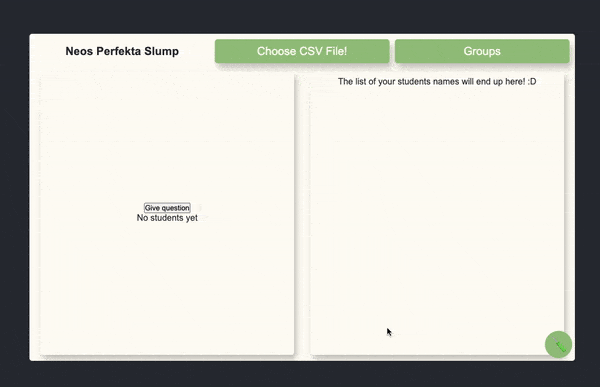

# NeosPerfektaSlump 2.0

[Try it here!](https://neosperfektaslump.neo.fyi)
**This site saves nothing about you or your files, everything is computed locally in YOUR browser.**

## WIP

this version will have account and uploadable files!

## about

A webapplication for creating groups and assigning random students questions fairly. 
It was made as a gymnasiearbete project and has some neat features.

### features:
* Get random student from list, fairly!
* Assigning random groups, just say how many!
* Exporting created groups:
    1. Download all groups to .txt.
    2. Copy all groups.
    3. Copy individual groups.
* Reading files.

As you can see in the code it is currently limited to .csv files since they are always formated
the same.

TODO
- [ ] make responsive
- [ ] make change between input types more clear
- [ ] make so copy to clipboard tells user it copied 
- [ ] change placement of input changer
- [ ] new icon/logo for the project?

### do

It would be cool to have the user uploaded file save, and the "progress" would sustain.
